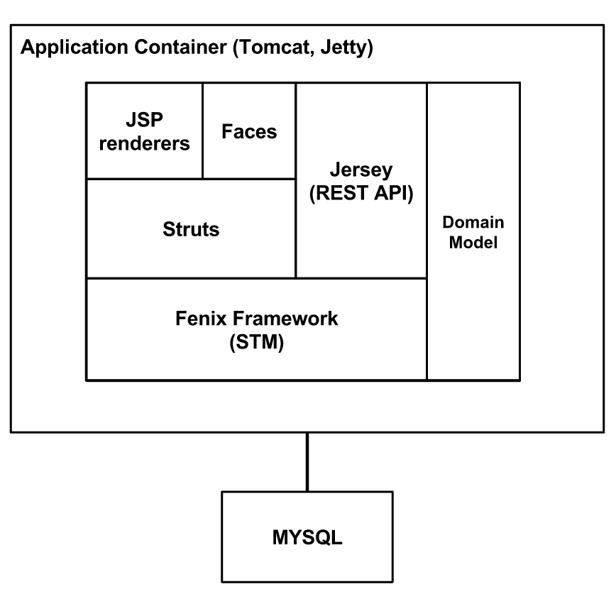
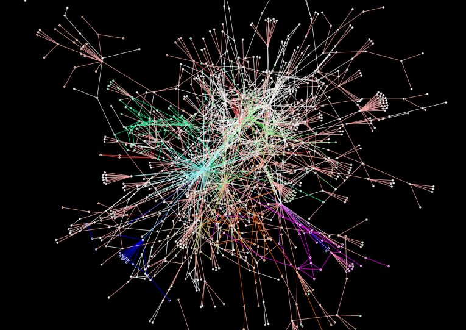
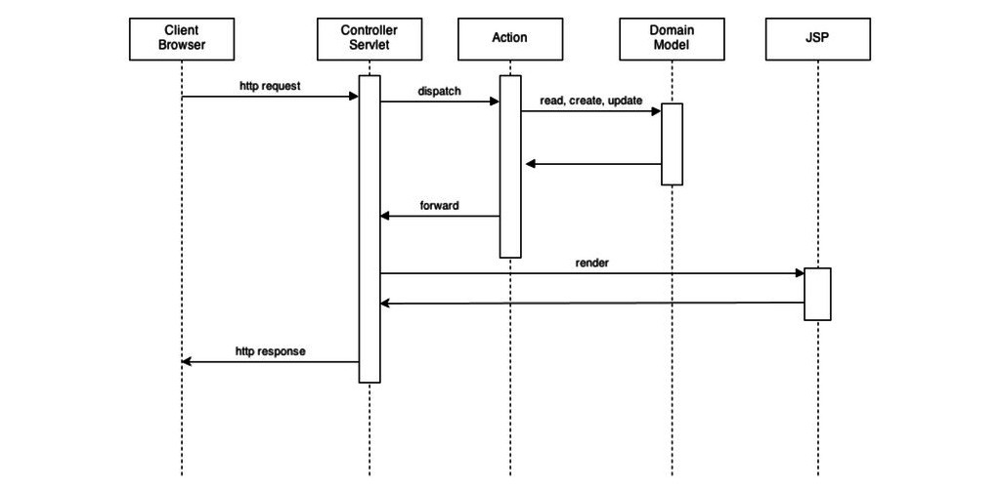

## [Architecture](./architecture.md)

On this page:

+ Technology
+ Domain Model
  + How to use transactions
  + How are the relations saved
+ Rest Interfaces
+ Struts
  + How do STRUTS process a Request?
+ Presentation
  + Renderers

### **Technology**

Fenix is a project has a great number of dependencies and uses several technologies that have been added to the project along with its development. Instead of talking about all of them we will just mention some of the more important ones to our architecture and its use will be described has we explain our architecture:


+ Java7
+ Java Server Pages
+ Renderers
+ Java Server Faces
+ Struts
+ Maven
+ MySql
+ FenixFramework
+ Bennu

### **Domain Model**
As you can see from the image, the same domain model is used across all the application code, this enables us to have a simpler architecture and is possible thanks to the use of FenixFramework.




Fenix Framework is a Java ORM that enables you to express the domain model as entities, the relations between the entities and its attributes. After having this specification, the framework automatically creates the Classes that implement the existing relations. You just have extend that classes and  implement the application logic.

The framework takes care of the persistency layer, saving the changes to the entities on the database (MySQL). It also handles the transactions and provides ways to ensure consistency.
All the data is kept on memory and the transactions are also done on memory. The updates done are  saved on the database from time to time.

#### **How to use transactions**
To declare a transaction you have to write your transactional method and it needs to be annotated with the keyword @Atomic. This annotation can receive as argument the type of transaction it will perform, it can be READ if it just reads data, WRITE if it does any write, SPECULATIVE\_READ if it normally just reads but sometimes it needs to write. The transactions can’t be used directly on the Action’s code, they should be on the domain.
This transactions will be run on the Software Transactional Memory and if they fail due to a write-write conflict then they will run more than one time. By these reason you have to be careful when contacting external services.

#### **How are the relations saved**



The domain model has 1370 Entities, 1802 Relations and 54 Value Types. By this reason, it can be hard to find out the implications of changing a given entity or relation. We have developed a tool named Fenix Domain Browser, that enables you to graphically visualize the relations between entities.

Each class is represented on the Database as a Table. This table is named with the name of the class or its superclass. The properties of that class are columns of the table. The relations between the objects are also columns on that table having has values the Object ID of the related object. When a the relation is * to * then we have a new table <Class1\_Name>\_<Class2Name> with two columns with the Object IDs of the objects who are related.

The persistency layer is hidden from the programmer and the Fenix Framework makes the relation between the Java entities and the Database (MySQL). FenixFramework also handles the transactions and the consistency.

### **Rest Interfaces**
We have REST API that enables developers to build applications that use the academic information available. Before the developers can use this information, the students need to give the required access to the application.

### **Struts**
Struts is a framework for web applications, It uses the Java Servlet API and implements the model view controller architecture (MVC). we are using the version 1.2.7.

The goal of struts is to separate the Model from the view and controllers. It Does the route between the requested path to the Controller and from the Controller to the View to be rendered.

Each Controller is implemented as a Dispatch Action, they fetch the information needed to the view and update the domain with the needed changes. It also express the forward between views.

Each view is written using Java Server Pages or Java Server Faces. This technologies enables you to write dynamic pages that are filled with information provided by the Actions.


#### **How do STRUTS process a Request?**
When a request arrives the Struts Controller Server, it inspects the information on the request and based on that it knows the Action for which it should dispatch the request. This Action will perform the appropriate business logic by reading, creating or updating the Domain Model. It also adds to the request all the information needed to render the view. After that, it returns a forward to the Controller Servlet that indicates the view that should be rendered. Finally the view is sent to the client as an HTTP response.

 


 For example, if a client sends a request for:


``` http
http://<fenixEdu>/public/executionCourse.do?method=marks&executionCourseID=1610612925705
```

This url can be decomposed in several parts. The initial part indicates that it is related with the module named public, so the mappings definition with the Actions will be on the file named struts-public.xml


``` java
<action type=”ExecutionCourseDA” parameter=”method” path=”/executionCourse”>

```


This mappings can also be done using annotations directly on the Action, on this case the ExecutionCourseDA it would be:


``` java
@Mapping(module=”public” path=”/executionCourse”)

```

After discovering the Action, it needs to discover the method that will be invoked. This information is sent on the request and on this case we have “method=marks”, so it will invoke the method marks on the action ExecutionCourseDA. All the remaining information on the URL are the parameters of that request and are available to the method. On this case we are asking for a specific execution course.

After executing the method it will return the forward to the view to be rendered. This forward can also be written using two methods: by annotation on the action or by definition on the struts-Module.xml file.

### **Presentation**

The main technology used to define our views is Java Server Pages (JSP). It is an HTML extension that enables you to build dynamic pages with behavior.
You define a template of HTML using Java embedded code. When used with struts (as it is the case) it provides you with lots of tags that cover the majority of functionality needed like print a given value from an object or iterate a collection of objects.

Besides JSP we also have use Java Server Faces (JSF) on our project. JSF is very similar to JSP, the main difference is that instead of setting the view parameters on the http request, they are loaded from a Bean. The Bean is a Java class that has all the information needed for the view. It also implements the behavior for that view.

#### **Renderers**
There are some kind of domain objects that are always rendered on the same way, to avoid having lots repeated code our team have developed Renderers. This technology basically provides a tag that knows how to directly render domain objects, depending on their type.