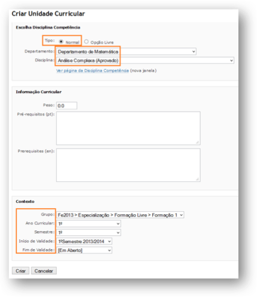
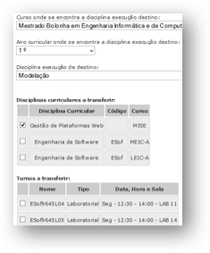
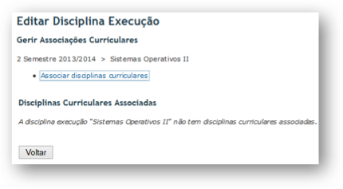

# [Courses](./courses.md)

+ Competence Course
  + Creating Competence Courses
    + Step One: Creating the Competence Course
    + Step Two: Defining Workload
    + Step Three: Define Objectives Program and Methodology
  + Managing Competence Courses
  + Publishing Competence Courses
  + Approve Competence Courses
  + Competence Course Versions
    + Create a new version
    + Approve a competence course version
    + Propose a revision to a version
+ Curricular Course
    + Create a Curricular Unit
    + Associate a Curricular Unit
    + Defining Rules
      + New Rule
      + Compose Rules
+ Execution Courses
  + Creating Execution Courses
  + Editing Execution Courses
    + Edit
    + Gerir Associações Curriculares ou Separar Execução
    + Move Announcements
    + Sent Emails
    + Remove
  + Join Execution Courses
  + Add Execution Courses 
  
In FenixEdu the courses are represented in three types. We will describe the various types of existing courses, which information is stored and managed in each of these types and the relationship between the various courses:

+ **Competence Courses** - Are the basis of information relating to curricular units. The management of these courses is the responsibility of the Department where it belongs (competence courses can only belong to a single department). The information in a racing discipline is:
    + Workload
    + Credits
    + Objectives
    + Program
    + Evaluation Method
    + Base Bibliography (Primary e Secundary)
+ **Curricular Courses** – This is the association between a \emph{Competence Course} and a \emph{Curricular Plan}. For a Course to used in a Curricular Plan, it must be approved before. The year and semester where this curricular plan is offered is determernined by the curricular plan. This contains the following information.
    + Group
    + Curricular Year
    + Semester
    + Beginning
    + End
+  **Execution Courses** - This is the association between the academic year and semester in which the \emph{Curricular Courses} was in operation. You can only create execution courses when the Curriculum Plan where they are located is also running. The information contained in execution is a discipline as follows:
    + Course Site
    + Schedule
    + Summaries
    + Announcements

## Competence Course

The responsibility to manage courses belongs to the Departments (creating courses or new versions of them) and the Scientific Council (Approving new competence courses and their versions). As mentioned before they are basis for creating curricular units, and only after being approved can they be used in curricular plans.

### Creating Competence Courses

Before you can create competence courses you need to have authorization to do so. This is granted in **Secretaria do Departamento> “Grupos de Gestão “> Disciplinas Competência**.

 

To create a competence course, go to **Bolonha > Disciplinas Competência > Consultar**. It should appear the existent competence courses of that department. Each course is attached to a **Scientific Area**, and a **Scientific Area** is composed of **Competence Course Groups**. Click in **Criar Disciplina** on the **Scientific Area/Competence Course Group** you want to create a course. It takes 3 steps.

#### **Step One: Creating the Competence Course**

Fill the academic year and semester, from which the course starts being available on the system, the name (in PT and EN), the level (First Cycle, Second Cycle, etc.) and the type of course (Normal or Dissertation) like shown in Image:

 

Click **Create** and move to the second step.

#### **Step Two: Defining Workload**
 

On this screen fill the information relative to the workload (Theorical,Problems, etc.) and the ECTS. After filling this form, click **Submit** and move to the next step.

#### **Step Three: Define Objectives Program and Methodology**
 

Fill with information regarding objectives, program and methodology for this competence course.

 

Click **Submit** to finally create the competence course.

 

After adding the coures it should appear within the department competence course list, in the **Scientific Area\Competence Course** you selected, as is shown in Image:

### Managing Competence Courses
 

A competence course can be in one of two states:

 

   + **Draft** - This is the initial state. In this state the course is still in construction in the department and is only visible to the group of people who can access manage competence courses in this departments.
   + **Published** - The discipline has all the information and is ready to approved by the Scientific Council.
 

Also the competence courses that weren't approved by the Scientific Council has the following avaible options:

   + **View** - View all the information avaible.
   + **Edit** - Edit the information of for that competence course. Is through the Edit operation that the state can be updated from **Draft** to **Publish**. This state can be changed until the competence course is approved by the **Scientific Council**. After that, the course can only be changed on the **Version Manager**.

   + **Delete** - Deletes the competence course (as long as it hasn't been approved). **This is irreversible**.
   + **Bibliografia** - Adding the base bibliografy (principal and secondary).
 

To add bibliografic references, click **Insert Bibliografic Reference** and fill the form with the blibliografic information as well the type of bibliography as shown in Image:

### Publishing Competence Courses
 

When all the information for a new competence course has been added, you need to published it for it to be avaible on the Scientific Council so that it can be approved.

 

Edit the course, and next edit the state information as shown on Image:

### Approve Competence Courses
 
To approve competence courses you should go to **Portal do Conselho Científico> “Processo de Bolonha”> Disciplinas Competência** and select the department you want to approve competence courses.

 

There it should appear all the competence courses for that department. Click the **Approve** link next to the competence course. A green label next to the competence should appear as shown on Image:

In Scientific Council you can do the following following actions:

   + **View** - Show all the information of a competence course (Workload, Objectives, Program).
   + **Transfer** - Transfer a competence course to another Department, Scientific Area or Competence Course Group.
   + **Unprove** - Revert the competence course from **Approved** to **Published**.

### Competence Course Versions
Sometimes is necessary to make some corrections to curricular units. For instance changing the ECTS number from 6 to 4.5. Creating versions of a competence course is done in the Department where the course belongs. To make a new version go to **Disciplinas Competência > Gestão de Versões**. A list of the approved competence courses should appear like in Image:

To view the details from a competence course click **Consultar**. A interafce should appear that allows you to view current versions and create new ones, like as shown on Image:

**Create a new version**

To create a new version click **Criar nova Versão**. In the next page you should select the academic year and semester where this new version should appear (the system does not allow overlapping versions). Add also the information about the competence course and fill the **Proposal Reason**.

 

After completing this information, click **submit**. In the next page you can update the base bibliography for a give course. To conclude this process click **Create**.

 

After creating a version, a new **Proposal**, with a **Pending** state, should appear in the Version Page as in Image:

**Approve a competence course version**
 

To approve competece courses go to **Portal do Conselho Científico > Processo de Bolonha** and click **Propostas de Versões**. A list of Proposals, pending and overall, for each department as shown on Image:

To approve a proposal you should, click on the department containg that version, and then click **Approve**.

After a new version is approved, all students enroled before the academic year and semester selected will be associated with the previous version, and new enrolments will use the new version.

**Propose a revision to a version**

Sometimes you may need to do some correction (maybe ECTS, workload, bibliography, etc.) in a approved version of a competence course. To do that on go to Version page and select a approved version and click \textbf{Propose Revision}. Fill all fields and click \textbf{Submit}.\\

A revision proposal stays in a pending state until approval is given by the Scientific Council.\\

## Curricular Course
After approved, competence courses can be used in the construction of Curricular Plans. Curricular courses agregate several information about a course, for instance the curricular year and semester as well the curricular plan group it belongs.

### Create a Curricular Unit
 

To create curricular units in curricular plains, go to **Portal da Administração Académica> “Gestão da Estrutura de Ensino”**, click **Estrutura de Cursos** and then in the operation **Gerir Plano** for the curricular plan you want to change.

Next click in **Criar Unidade**, in the curricular Plan where you want to add the new curricular unit like is shown on Image:

On the next page, fill with information relative to the curricular unit and what is context (group, year, semester, begining and end). An image of the form can be seen on image bellow. There are two types of curricular units that can be added to the curricular plans.

   + **Normal Curricular Units** - There are curricular units that exist in Departments (competence courses).
   + **Free Option Curricular Units** - Are slots that are created within a curricular plan that can be filled by other units from other curricular plans. This give the student the possibility to choose what course to do. In the case of **Free Options** you also need to add a name to the curricular unit.
 

After filling the form with all the information, click **Criar**.

You can do the following operations over curricular units.

   + **Edit** - This allows changing all the information for a curricular unit. You can also add a new context to a curricular unit.
   + **Apagar** - Curricular units can be erased if they aren't associated with students.

### Associate a Curricular Unit
 

**Associate Unit** allows that a curricular course can to be associated with more than one context. This allows for curricicular units to appear in differente semesters or years.

To do this, Click **Associate Unit** and fill with information related to the group you want. Finally finally click **Associate**. A curricular unit associated to two different contexts is shown on Image:

### Defining Rules
Curricular units and groups can have rules that affect how students can enrol in them. Among other, you can set:

   + Requirements between curricular units.
   + Mutual exclusion between groups and curricular units
   + Enrolment only with the Degree Coordinator's Authorization
   + Maximum of credits can a student can take on given group
 

 

To add a new rule, click **Define Rules**. Next on the group or curricular unit click **Define Rules**. Now you can choose, either to add a **New Rule** or **Compose Rules**.

**New Rule**

Depending on the type of rule (group or curricular unit) you may have several options. In Image below we create a Exclusivity rule between the group **Formação Livre** and the group **Competencias Transversais**. This rule implies that students can only enrol in curricular units from one of the groups. The rules have a **Validity** associated so that rules can be inserted into different curricular plans.

When a rule is created it should appear in the curricular plan right bellow affected target.

**Compose Rules**

A rule composition allows that existing rules can be composed using logic operators **& (AND)** and **|| (OR)**. To add rule composition , access the Curricular Plan an in the group or curricular unit you want, click in **Define Rule**.

On the existing rules for that group appear. Click in **Compose Rule** and select from the existing rules those you want to use and the logic operator. Click **Create to finish**.

You can also \textbf{**Edit** the begging or end of a validity and **Remove** the rule.

## Execution Courses

Creating execution courses is task that is done every semester (or every course period). For every Curricular unit that are avaible in active curricular plans there should be created a execution course. Execution courses are managed in **Portal Administração Académica > Gestão das Disciplinas de Execução**.

Execution courses have all the information from the competence courses (ECTS, program, workload, bibliography) and from curricular courses (year and semester), as well the contents avaible in course site. Each execution course as also associated the following information:

+ Course Site
+ Faculty
+ Attending Students
+ Evaluations
+ Schedule
+ Summaries
+ Announcements

### Creating Execution Courses

The action **Criar Disciplinas de Execução** allows you to create all the execution courses corresponding to one or more courses in execution in that execution period (year/semester). First select he type of course and click **Continue**. Next select the execution period, the courses you want to create the execution courses and click **Create**. In the next page a message with the information about all the execution courses created should appear.

### Editing Execution Courses

**Editar Disciplina Execução** allows to **Edit** (including association and separation of curricular courses) as well **Remove** for that execution period.  First select the degree type. Next select he execution degree and curricular year from the execution course you wish to edit. Click **Continue**. A list with all execution courses for that degree/curricular year should appear.

**Edit**

Allows editing the execution course information. Typically this operation is used to update the name or acronym.

**Gerir Associações Curriculares ou Separar Execução**

**Attention**:

You should exercise extreme caution when doing these operations, as they interact with several information.

This functionality allows to do certain tasks that join or seperate execution courses. You have the following operations avaible:

 

\begin{itemize}

+ **Associate curricular courses**
  
  Allows binding more curricular courses to a execution courese. (that don't have yet a execution course). Select the degree where the curricular course belongs and press **Continue**. Next you have a list with all the associations already made as shown on Image:

 

 To unbind a curricular course, just click **Disassociate**.

+ **Transfer curricular courses**
  
   To transfer curricular courses to another execution course, select the degree, the execution course and the curricular year as shown on Image. You can also transfer schedules by checking the shifts you want to transfer.

+ **Separate execution course**
  
   If you wish to seperate curricular courses into new execution coureses click **Separate**. Select the curricular courses and shifts you want to transfer and click **Ok**. A new execution course should appear with the selected curricular couress and shifts.

**Move Announcements**

You may want to transfer the annoucements from a execution course to another. The annoucements can be movied from a execution period to another. First select the execution period you want. All execution courses in that period should appear. Next select the execution course to where you want to move the annoucements. Check the annoucements you want to move and click submit.

**Sent Emails**

You can also see the emails sent within the context of a execution course. The mail records are stored for a while. By clicking in S**ent Emails** you should get a list of emails sent, as shown on Image:

**Remove**

You can remove the execution course, only when there isn't any information associated with it (schedule, sumaries, announcements, etc.). To remove a execution course click in \textbf{Delete}. A confirmation should appear. Please keep in mind that this operation is irreversible.\\

### Join Execution Courses
 

This operation allows joining two execution coures into one, meaning all the information from a execution course (faculty, sumaries, annoucements, students, etc.) will be connected into a single execution course. You can only join execution coureses within the same execution period (year/semester). To join select execution coureses select the execution period, Origin degree and Destination Degree. Click **Continue**.

 
Next, select the origin execution course and the destiny execution coruse. and click **Continue**. You should be presented with a warning message. Click ok to continue.Please keep in mind that this operation is irreversible.

### Add Execution Courses
 

This option allows to create execution courses manually, and later being associated with curricular coureses. Click **Add Execution Course**, set the execution period, name, and acronym. Click **Save**.

To use the execution course, click in **Edit Execution** course and select the execution period. Check the option **Courses not associated with curriculums**. and click **Continue**. A list with execution courses not associated with curricular courses should appear. Next follow the instructions from to associate curricular courses.

   