## [Degrees](./degrees.md)

+ Create Degree
+ Edit a Degree
+ Remove a Degree
+ Curricular Plans
  + Create Curricular Plan
  + Managing Curricular Plans
    + Managing Curricular Plans on Scientific Council
      + View
      + Edit
      + Delete
      + Group
    + Manage Curricular Plans on Bologna Portal
    + Change Structure (Groups)
    + Order Groups
  +  Define Rules
     +  New Rule
     + Rules Composition
  + Create Unit
  + Approve Curricular Plan on Scientific Council
    + Create Degree Unit in the Organizational on Administrator
  + Create Execution Curricula on Administrator

FenixEdu suports the creation of the following degree types **Bachelors**, **Masters**, **Doctorate**, **Advanced Formation** and **Advanced Specialization**.

To create Degrees in FenixEdu is in **Scientific Council**. This operation is made through the **Scientific Council Portal** > D**egrees and Curricular Plans** > **Create Degree**.

## Create Degree

In the creation form of new degrees, as shown in image, all fields marked with (*) are mandatory.

Depending on the **Degree Type** the system will fill the **Minimum ECTS Credits field**. The value can be adjusted.

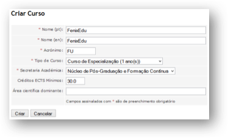

When the fields are filled in properly click the **Create** button. A message is shown indicating the successful creation of the degree, as seen in Image:

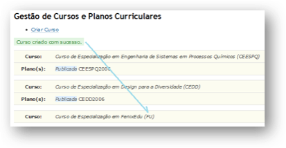

## Edit a Degree

It allows updates to the information inserted on the Degree creation (Degree name, both in english and portuguese). This information can only be updated for the current academic year.

In the Edit option it's also available the possibility of inserting **Oficial Publications**, meaning that every time the Degree is published in the Official Laws Decret Journal (when changes to the Curricular Plan occur) it must be introduced the publication through **Create New Publication**, like seen in image:

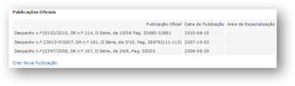

This information must be always updated, since it's used in official documents like the Diploma Supplement.

## Remove a Degree
Allows that the Degree is deleted (as long as it does not have any associated information, like a Curricular Plan).

## Curricular Plans

A Degree can have more than one Curricular Plan. If there are substantial changes to a Curricular Plan, a new plan should be created.

### Create Curricular Plan

Allows the creation of Curricular Plans associated to the Degree. To create a Curricular Plan, we must give it a name (an acronym, as shown below in image).

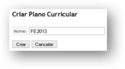

The new Curricular Plans state is Draft, meaning that they can not be seen in the other Portals in the system, nor can they be used to perform any action (like enroll students). In Image we can see how they look.

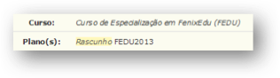

### Managing Curricular Plans
The Curricular Plans are managed through different Portals. We're goint to describe which operations can be made on the Curricular Plans in the different Portals.

#### **Managing Curricular Plans on Scientific Council**

The following operations are avaible through Cientific Council:

##### **View**
Through this option you can view the information of the Curricular Plan. Beside the courses (that can be viewed by group or semester/year) that are in the Curricular Plan, the rules (of enrolment in courses) and the structure (groups) of the Curricular Plan can also be consulted, as the Image ilustrates.

  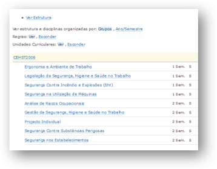

##### **Edit**

This option allows you to:

+ Curricular Plan State - you can see the current state of the Curricular Plan and the Curricular Plan name (it can be edited).
  + Draft - it's the initial state of the Curricular Plan.
  + Published - it means the Curricular Plan is almost finished. This middle state is useful so that some final adjustments can be done. This state no longer allows that the Plan be edited in the Bologna Portal (it can only be updated in the Academic Administration Portal, or the Scientific Council has to change the state back to Draft).
  + Approved - it's the final state in which all the courses and rules are defined. Any update to the Curricular Plan in this state can only be done in the Academic Administration (the Approved state can not be changed by the Scientific Council, so changing the state to Approved is a very sensitive operation).
 

+ Manage Access Group - Where you can add or remove members of the group of people that are able to participate in the definition of the Curricular Plan.
+ Manage Coordination Teams - Where you can add or remove members of the Degree Coordination team, no the academic years in which the Degree had/has an execution.
 

This options are summed up in the next Image:

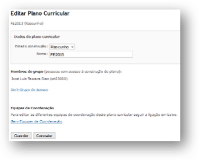

##### **Delete**

The system only allows to delete Curricular Plans that still don't have any associated courses. To delete a Curricular Plan, click on Delete and on the next page click the Confirm button.

 

A confirmation popup box is displayed to ensure that you really want to delete the Curricular Plan. Click on OK to delete or Cancel to cancel the operation, like shown on image:

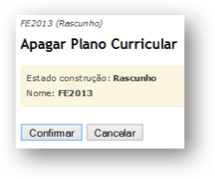

##### **Group**

It allows to add or remove members of the group of people with access to define a Curricular Plan (it's done in the Bologna Portal).

+ Remove Members, select the member or members to remove from the group and click on Remove Members, as in the image:

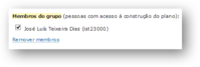

+ Add Person, adds persons to the group of people that can define a Curricular Plan. Insert the person username and click Add person, like in the Image:

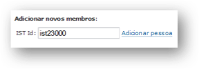

#### Manage Curricular Plans on Bologna Portal

It's through this portal that the Curricular Plans are defined, created by the Cientific Council. To manage the Curricular Plan click on **View** under the **Curricular Plans** section.

 

All the existing Curricular Plans are listed. The funcionality Manage Plan will be available if you are part of the authorized group.

 

Through **Bologna > Curricular Plans > Manage Plan**, it's possible to create Curricular Plans as well to define its structure and rules, with the following operations (also shown in Image):

+ Change Structure (Groups)
  + Manage Groups
  + Order Groups
+ Define Rules
  + Create course unit
  + Associate unit

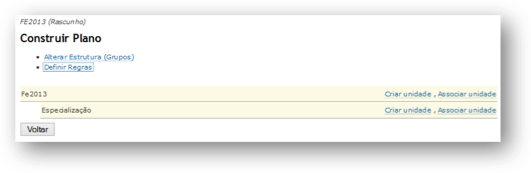

#### **Change Structure (Groups)**
Allows the creation and structure management of the Curricular Plan. The structure regards the Groups that might exist in the Curricular Plan as well as their order. The initial structure of any degree is made of by the Degree Acronym and by a group (top group) which states the cycle of the studies (1st cycle, 2nd cycle, 3rd cycle and Specialization), as seen above on Image:

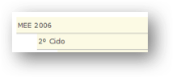

It's not mandotory that a Curricular Plan has more groups besides the initial structure, however using groups (ex: Options, Dissertations, Specializations, etc) in the Curricular Plans is a common practice.

 

In the funcionality **Change Structure (Groups) > Manage Groups**, the following operations are available:
 

+ **Create Group** - Allows the creation of groups/sub groups in the Curricular Plan
 

Be aware that it should exist only one top group, that in this example is **Specialization**, on image.

To create a group, click on **Create Group**, on the Curricular Plan structure where you want to create the new Group.

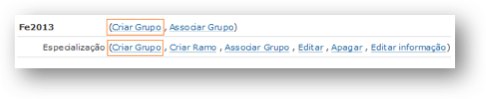

Write the name of the group (PT and EN) and click **Create**, as shown in Image:

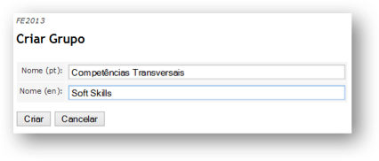

Everytime a group is created successfully a message is displayed. The previous instructions should allways be followed everytime you want to update the structure (groups) of the Curricular Plan. The Image shows the operations and message.

+ **Associate Group** - The group association allows that any change made to the \emph{group to associate} is reflected on the associated groups.

To associate a group, click on **Associate Group**, select the group you want to associate and click **Associate**. You can see it on image 2.2.1.2.1.

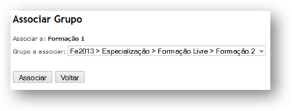

Following the previous example, any change that is made in the group **Formação 2** will reflect on the **Formação 1** group. As an example, lets create a subgroup in the **Formação 2** group. This change will automatically be reflected in the **Formação 1** group, as seen in image:

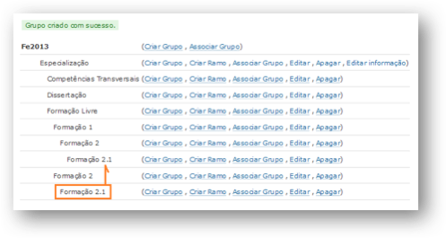

+ **Edit** - It makes it possible to change the name (PT and EN) of the group and it's validity period. The possibility of a group having a validity period allows that the structure be changed along several academic periods in which the Curricular Plan has an execution.

To edit the group click on **Edit**, make the necessary changes and click **Submit**, like image shows:

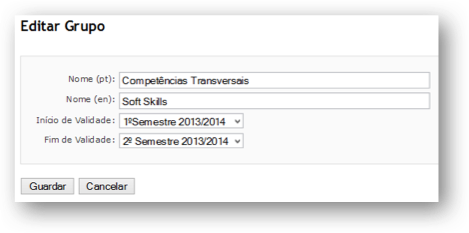

In the previous example the group Competências Transversais (and all the groups and courses information) will only be on the Curricular Plan of 2013/2014.

+ **Delete** - The system allows that the groups are deleted as long as they don't have any information (subgroups or courses).
 
To delete a group, click on Delete (on the group to delete). A confirmation page is displayed, you should click on **Yes** to confirm the operation or in **No** to cancel it:

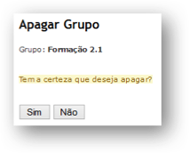

#### Order Groups

This funcionality allows the structure of groups to be organized accordingly each Curricular Plan necessities.

To order the groups, in Change Structure click on Order Groups, like shown on image:

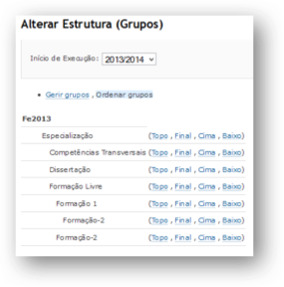

The order of the groups is done based on the first Curricular Plan that had an execution, on this example in 2013/2014. Selecting the different academic periods in which the Curricular Plan had an execution 
there can be made different orderings of the groups.

The order options available are:

+ Top - moves the group to the top of the other groups (of the same level)
+ Bottom - moves the group to the bottom of the other groups (of the same level)
+ Up - moves the group a level up
+ Down - moves the group a level down.
 

In the following example, the group **Competências Transversais** will be moved to the bottom of the structure.

 

In the group **Competências Transversais** click on Bottom and in the next page click **Yes**, as seen in image:

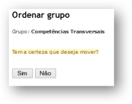

After the previous operation the **Competências Transversais** group has passed to the bottom of the group structure of the Curricular Plan, like the image shows.

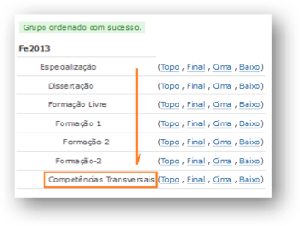

### Define Rules

This functionality allows to create rules in the groups and curricular units of the Curricular Plan.

 

Those rules can be of precedence between curricular units, exclusivity between groups or curricular units, can only enroll in course with Coordinator authorization, limiting the number of credits that are

possible to make in a group, among other rules.

 

To insert a rule, access the Curricular Plan management and click Define Rules, after that on the wanted curricular unit or group click on Define Rule. In the next page you can see the existing rules for that course or group and the options: New Rule and Rule Composition (as seen in image).

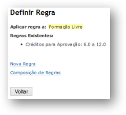

#### New Rule

Depending on the type of rule (group or course) that it's being created, the list of options changes.

 

In this example, we'll create an Exclusivity rule between the Free Formation group and the Transversal Competences group. This rule means that the students can only enroll in courses of one of the groups.

 

The rules have an applicable time period, meaning that can be introduced different rules in each Curricular Plan that had/has an execution.

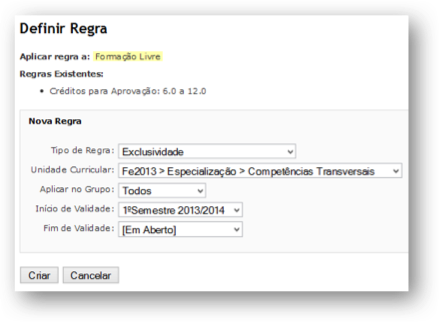

As seen in the image above, click **Create** to confirm the rule creation. The rules that exist in the Curricular Plan become automatically visible, as shown in image:

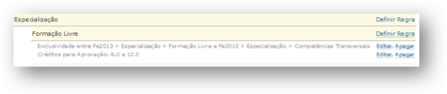

In this example Free Formation has two rules. One rule of exclusivity between groups and another rule of credits limit in the group.

#### Rules Composition

The composition of rules allows that the existent rules can be composed through logic operators **& (AND)** and **|| (OR)**, in which the composition using **&** means the application of all composed rules and **||** means the application of one of the composed rules.

 

To make a composition of rules, go to the wanted **Curricular Plan** management and on the group or curricular unit click on **Define Rule**. On the next page you can see the existing rules on the course or group. Click on Rules Composition, select the rules you want to use and the logic operator (**&** or **||**), and click **Create**.

 

In this example, this composition of rules means that the Students can be enrolled in one of the groups and can only make 6 to 12 credits in the group, as seen in image:

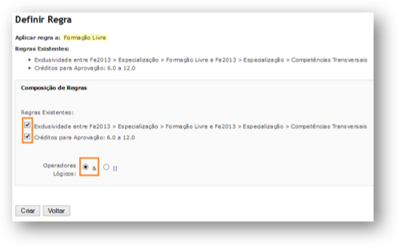

The options **Edit** and **Delete**, available on the rules of the Curricular Plan allow to:

+ **Edit** - Change the begin and end of the time interval in which the rule is valid
+ **Delete** - remove the rule

### Create Unit

### Approve Curricular Plan on Scientific Council
#### Create Degree Unit in the Organizational on Administrator
### Create Execution Curricula on Administrator
