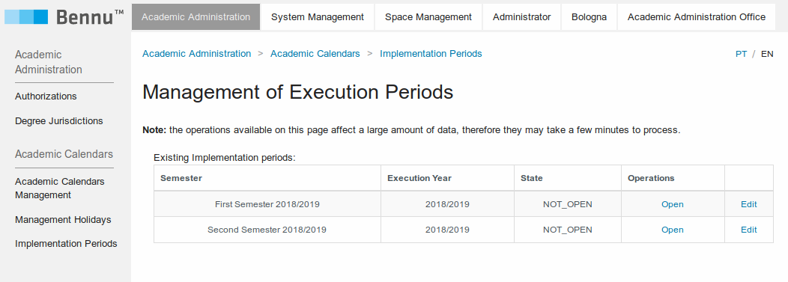
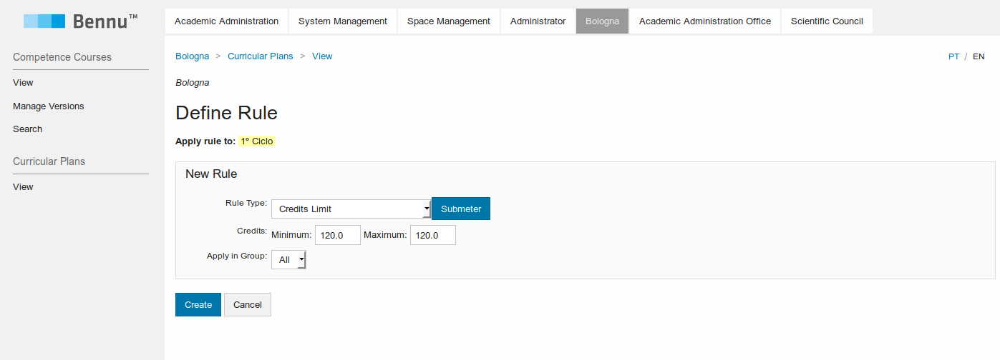

## [Getting Started](./getting-started.md)

```
NOTE: This tutorial is for FenixEdu Academic version 18.8.1 or later

Since version 19.0.0 it is necessary for all the resource bundles to be UTF-8 encoded.
When using JAVA 8, this change requires the installation of a Java Extension Mechanism available here
The further releases of Java will load all the resources bundles as UTF-8 by default.
```

## Configuring FenixEdu
Now that your application is running, it is necessary to configure it to a given school.
We will guide you through the process of inserting all the information necessary to configure one degree with one course, and enroll one student. The data we are using here is for example purposes only, you should use data that suits the needs of your school.

### Using ashes theme
**Before changing to ashes theme, read the instructions below:**
Using ashes as your application theme implies the core portals and sections of the application to be configured in a structure similar to below:

+ Application
  + Child
    + Application (Install)
      + Functionalities


So, you should create child folders on your application and install the application you want inside of it.

If you **just ran your application** please make the following changes to apply the needed structure for ashes theme:

+ Delete the application System Management (Don't save it yet)
+ Create a child named "System Management" with a correspondent description and path
+ Install the System Management Application inside the child you just created.
+ Save it.
  
You are now able to change the theme to ashes.

Now, you can install the portals and sections you need in the following steps **considering this structure**.

### Add the core portals and sections to your application
After the installation the application comes with just the system management portal, you will need to add all the other portals and functionalities on this portal.

You should have a screen like the image, in this guide we will be using the ashes theme although in your application you can use any theme you prefer.


To install all the portals and functionalities that you will be needing in this guide head to Manage menu and add the items that we will be using, by pressing the install Application button. The idea is that in the end you have the tree on the image below:


Add the dynamic group #managers in the Access Expression when needed.

Now you are ready to start inserting the academic data into your application.

### Creating Curricular Calendars

The first step is to create the curricular calendars. This represents the periods where things are supposed to happen (like classes, enrollments, exams etc).
First go to Academic Administration > Academic Calendars Management and select Create calendar.
Let's call this calendar "Academic Calendar" for this example. Submit.


Next click 'Create entry' in the bottom to create a new year.


Now, select type "Academic Year", name it the current year (e.g. 2018/2019), the beginning at 01/09/2018, 00h and 00m and the end at 31/08/2019, 23h and 59m. Submit.


Now lets create an academic semester. Select the academic year you just created (if not already selected) and click 'Create entry'. Select the type "Academic Semester" and name it **First Semester**, the beginning at 01/08/2018, 00h and 00m and the end at 01/02/2019, 23h and 59m. Submit.


Select the year in question to add another semester and do the same as before, but this time for a Second Semester, beginning at 01/02/2019, 00h and 00m. and the end at 31/08/2019, 23h and 59m. After this, the calendar should look like as shown on Image:


### Create a Campus

We need to create a campus for this school. Before creating a campus, we need to create the corresponding classification. In **Space Management** > **Space Classification Management**, press the **Create Classification** button. Fill the form with the following:

+ Name: Campus
+ Parent Classification: Base (default value)
+ Code: 1

Submit. Go to the sub-tab **Space Management**. Then click the link **Create Space**. Select the campus classification, and then give it a name and a date when it should start operating:


### Activate the Current Period

Next we should activate the period we've created before. Go to **Administrator** > **Implementation Periods**, and you should see the two Semesters that you have created before. First click on **Open** on the **First Semester**. Next you should click **Make Current** to make that semester the currently active.



### Create Associated Object

Now we need to create some primitive objects about the organization of your school. To do this, head to **Administrator** > **Manage Associated Objects**.


### Create a Department

First lets create a Department. Click in the **Create** link below **Departments**. Fill the field with the information present on the image below:


When you are deploying your installation of FenixEdu you will need to create an object of these for each department in your institution.

### Create a Academic Office

In the **Associated Objects** page, click in **Create** link bellow  **Administrative Office**. Select the type **Academic Office**, fill the remaining fields, and click **Submit**.


### Create an Empty Degree

In the **Associated Objects** page click in **Create** link bellow  **Empty Degree**. Select the recently created Academic Office and click **Submit**.


### Create a Scientific Area within the Department

In FenixEdu, Courses are grouped together within a Scientific Area. You can see this as, for instance, the group of courses of **Distributed Systems** within the course of **Computer Science**.

To create one, click **Create** next to the department you want to add, in this case, Departamento Civil. Next fill with the same information as shwon in the Image below:


### Create a Competence Course Group within the Scientific Area
Competence courses are courses descriptions that can be instanced for every execution. You can see this concept as the **Operative Systems** Competence Course can be instanced as **Operative Systems 2016**, **Operative Systems 2017** and **Operative Systems 2018**. These Competence Courses are organized in Competence Course Groups. We need to create one of those for our application.

To create one, click **Create Competence Course Group** in the Scientific Area . Next fill with same information as shown in Image below:


### Competence Courses

Now we are going to create the competence courses. They are created before creating specific courses because they might be administered to more than one degree (e.g. the same course of **Calculus** being taught to **Civil Engineering** and **Computer Science**) To learn more about competence courses check section [Courses](../courses/courses.md).

The user now needs to give himself authorization to manage the competence groups. To do this go to **Scientific Council** > **Competence Course** and click the button **manage access group**. Check the user checkbox you want to add to this group and then hit A**dicionar Pessoa(s)**.

### Creating Competence Courses

To create a competence course, head to **Bologna** > **Competence Course** > **View**. There you have the Scientific Areas and Competence Course Group you've just created before. Click in **Criar Disciplina** next to the competence course group you just created.
In the first step, fill the form with the following information:


Hit **Submit**.

Next we need to define the work hours. Fill with the same information as in image and hit **Submit**.


Finally we need to define the objectives, program, and evaluation methodology. You can leave them blank and hit **Submit**.


You should end up with a curricular course as shown in Image below:


### Publish Competence Course

Now its required to publish the competence course. Click in **Edit** operation on the course we just created. You are presented with a page where you can edit all the information you've entered before. We now are interested in editing the state, from **Draft** to **Publish**. Click on the first **Edit** link on that page.

You should be presented with a form as in image. You should just change **Estado** from **Rascunho** to **Publicada** and hit **Submit**.


### Approve Competence Course

The next step is to approve the competence course. This is done by going to **Scientific Council** > **Competence Courses**. On the competence course you've just created, click in the operation **Approve**. The state should change to a green **Approved** as shown in the Image below:


### Degree Types

The last step is to create a degree type. This can be achieved in the **Administrator** > **Manage Associated Objects** interface. Click the link **Create** below **Degree Types**. Fill the form as the image bellow and hit **Submit**.


## Degrees and Curricular Plans

We have now enough data to start creating a degree.

### Create a Degree
We now can create a degree. Go to **Bologna Process** > **Degrees and Curricular Plans** and then click **Create Degree**. Fill the form with the same information as in image. To learn more about Degrees check Chapter [Degrees](../degrees/degrees.md).


### Create a Curricular Plan

Now is time to create a Curricular Plan. On the **Degree and Curricular Plan Management** click the operation **Create Plan**. Use **2018** as the curricular plan name and choose **Year** in the **Duration** field.

### Change the Curricular Plans

We now need to actually start adding competence courses into this degree. Go to **Bologna** > **View (Curricular Plan)**. The degree and curricular plans that we created should appear. Click in the operation **Manage Plan**.

Next click the Create course unit, next to First Cycle. Fill the resulting form with the information in Image:


### Define Rules
Now we are going to define some rules. Rules are restrictions in the way the degree works. You can learn more about rules on Section **Rules**. In the build Plan page, select **Define Rules**. Next select **Define Rule** in the **First Cycle**. Select **Nova Regra**. Insert the data as follows:



And hit **Submit**. A message bellow the **First Cycle** should appear saying that students are required to do 120 credits to be approved at this course.

### Academic Authorizations

In order to create a program conclusion we are required to have been granted to do so. Head to **Academic Administration** > **Authorizations**, click **manage** on the **Manage Curricular plans structure**.


To create a new Authorization just click in the **Criar nova Autorização**. Next, select the **Person or Unit** as the intended user and drag it into the **Offices** slot from the right **Academic Office** > **Academic Office** and to the Courses slot drag **Degree (BSc)** > **Engenharia Civil**. When you are done hit **Criar**.


### Create Program Conclusion
We need to create a program conclusion. Head to **Academic Administration** > **Program Conclusion Management** and click the operation **Create**.

Fill the resulting form with the information in Image:


Click **Save**.

After that go to **Curricular Plans** > **View** and click **Gerir Plano**, then click **Alterar Estrutura (Grupos)** and click the first **Edit** and select the **Apuramento**.


Click **Guardar**.


### Approve the curricular plan

The final step is to approve this curricular plan. To do this is to we need to go the **Bologna Process** > **Degrees and Curricular Plans**.

Here we are going to select edit our current curricular plan **2018** and change it from Draft to Approved. Click the operation **Edit** next to the **2018**.

In **Edit Curricular Plan** just change the **Construction state** from **Draft** to **Approved** and click **Submit**. A message should appear saying that curricular plan changed successfully.


### Executing Courses and Curricular Plans

Until now we've been defining our degree structure in a abstract sense, since they are not bounded to years yet. Now that we have a degree ready, we can now execute it.


#### **Executing the Curricular Plans**

Go to **Administrator** > **Create Curriculum Implementation**. Select **Bologna Degree** (the same we configured the Course with). Fill the form and submit.A message should appear saying what curricular plans where correctly created.


Now got to **Periods** > **Period Management** and add the intervals for the course, these intervals include class, exams and grade publication dates.


#### **Academic Authorizations**

In order to create execution courses we are required to have been granted to do so. Head to **Academic Administration** > **Authorizations**, click **manage** on the **Manage Execution Courses (Advanced)**.

To create a new Authorization just click in the **Criar nova Autorização**. Next, select the **Person or Unit** as the intended user and then drag it into the **Offices** slot from the right **Academic Office** > **Academic Office** and to the Courses slot drag **Bologna Degree (BSc)** > **Engenharia Civil**. When you are done hit **Criar**. Image shows a correctly filled authorization.


You need to give yourself authorization for the following operations:

+ Manage Execution Courses
+ Manage Execution Courses (Adv)

You should also drag the "Academic Office" from the left menu to the "Manage Execution Courses" authorization that you just created.
We are going to need these later, so might as well add them right now.

+ Register Students
+ Enroll Students
+ View Full Student Curriculum


### Create Execution Courses for the Active Curricular Plans

After giving yourself the previous authorizations, a new set o operations should have appeared on the left menu, titled **Gestão das disciplinas de execução**. From that menu select **Criar Disciplinas de Execução**. Next select **Degree (BSc)**.

On the following screen select **First Semester - 2018/2019** and select the curricular plan **Civil Engineering - 2018**. A message should appear saying the execution courses were successfully created.


## Student Enrollment

Now our **Example Engineering School** has a degree being executed. We can now enroll a student into our school and enroll him in this degree.

### Ingress Types

We will also need to define the different ingress types. Go to **Academic Administration > Academic Administration (Spring) > Manage Ingress Types**, and press create. For an ad-hoc enrollment you only need to fill the Code and Description fields of the form.


### Enroll a Student

To enroll a student just go to **Academic Administration Office > Register Student**. On the first form you will need to fill it with information the initial information about the student. Fill it with the information from the image below:


After submitting a second form, an even bigger should appear, with more detailed information. Fill it with information as shown in Image below: 


**Attention**:

In the **Previous completed degree** section of the form you are supposed to use **Portugal**. When you start writing it a drop down should appear. Select **Portugal** from that drop down.


Finally a form should appear asking you to confirm the data you just inserted. Just hit **submit**.


### Enroll a Student into Courses

At this moment we have **John Doe** enrolled in our school on the degree we've created. However he is not enrolled in any courses. We now should add enroll this student into courses. First go to Academic Administration Office > View Students and in the **Number** use 1 (student numbers are attributed sequentially so the first student to be enrolled is number 1) and hit **Submit**.

The student page should appear and in registrations we can see that although he is studying in **Degree (BSc) in Civil Engineering** he has 0 enrollments this year. Lets change that. Click **See Process »**.

In the **Enrollment Process** look at **Curricular Plans for the Student** and select **Enrollment Management**. Next in **Enrollment in Courses** select **Enrollment in Courses (with rules)**. In **Course Enrollment (with rules)** you should select what courses you want to enroll the student. In this case, we only have one. Select the checkbox to the right of **Reinforced Concrete** and hit **Save**. Our student is now enrolled.
