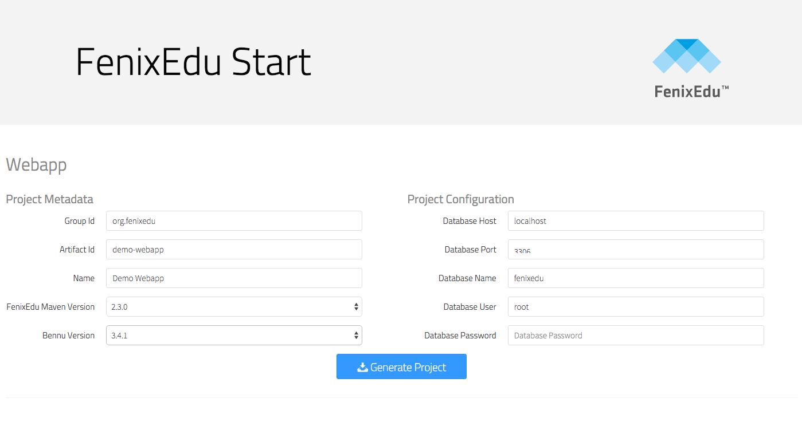

## [Installation](./installation.md)
This procedure will and download all the files and create all the tables on the database necessary for the system to run.

### Install the necessary software

Before you can install FenixEdu locally, you must install some software packages in the hosting machine.

The following commands, intended for ubuntu-based operating systems, will add a new repository that allows you to install Oracle's JDK via apt-get and will install all the required software:

``` bash
sudo apt-get install maven
sudo apt-get install git
sudo apt-get install mysql-server mysql-client
sudo add-apt-repository ppa:webupd8team/java
sudo apt-get update
sudo apt-get install oracle-java8-install
```

## Configure Java and Maven
FenixEdu is a big web application. That is why the default memory parameters are not enough to compile and run an instance of FenixEdu.

To circumvent this issue, you must export both the **JAVA_OPTS** and **MAVEN_OPTS** to your operating system environment. To do this, you can add the following entries to your **.bashrc**:

``` bash
export JAVA_OPTS="-server -Xms256m -Xmx1024m"
export MAVEN_OPTS="$JAVA_OPTS -Dorg.apache.jasper.compiler.Parser.STRICT_QUOTE_ESCAPING=false"
```

After this, you should **source** your .**bashrc** file or simply restart your shell.

## Create an empty database
Assuming that your mysql user is root and that the database name where you will install FenixEdu is called fenixedu, you must create such database. For that, you can execute the following one-liner:

```bash
mysql -uroot -e "create database fenixedu" -p
```

The command above will create an empty databased named **fenixedu**.


**Attention**:

The mysql user you specify during the installation must have the necessary grants to write and create new tables.

### Generate a WAR
Next we need to generate a WAR for web app. The easiest way to make it is to go to https://start.fenixedu.org/webapp and click "Generate Project":



This will download a zip file you need to inflate. Open the file "demo-webapp/pom.xml" and add the following dependency:

```xml
<dependency>
    <groupId>org.fenixedu</groupId>
    <artifactId>fenixedu-academic</artifactId>
    <version>${academic.version}</version>
</dependency>
<dependency>
    <groupId>org.fenixedu</groupId>
    <artifactId>fenixedu-commons</artifactId>
    <version>${commons.version}</version>
</dependency>
```
You should select a version for fenixedu-academic and fenix-commons from the [github repository](https://github.com/fenixedu).

### Bootstrap FenixEdu Academic
After Maven generates the installation code, you must bootstrap it. We made this step seamless, so you only have to start the application normally with:

``` bash
cd demo-webapp
mvn tomcat7:run
```

After you run this command, FenixEdu will start, you will have to point your browser to the following URL:

http://localhost:8080/demo-webapp/

Fill the form with the parameters for your institution. When you are finished, the applicaion will start normally, login with the credentials that you just set on the previous step.


